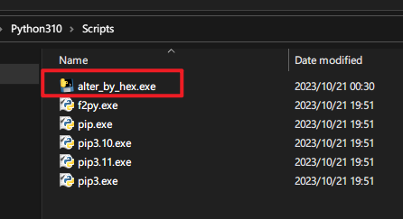

# destory-absolute-path-in-python


# 项目初衷

**省时省事**

无论是用Anaconda的conda还是Pycharm的virtual environment开发的项目，相信大家对使用pyinstaller工具打包项目并不陌生，你可以通过虚拟环境或原生的环境去打包。那使用虚拟环境去打包，它会依照最小原则打包程序运行所依赖的库，避免打包一些不必要的库，可以最大限度的缩小程序的体积。虽然虚拟环境有众多优势，比如复制和保存已有的虚拟环境，方便我们复用。但是，使用不当，虚拟环境也会各种抽风，比如pycharm的venv，明明刚成功安装的包，就是死活调用不到，重装也无济于事，即使在大型项目中成功的打包了运行环境，在运行过程中还是会出现各种各样奇怪的问题。当然除了上述通过虚拟环境将项目打包成一个或包含多文件的可执行程序的方式。对于大型项目pyinstaller打包环境是很慢的，目前pyinstaller还不支持增量编译，所以失败的话就得重新打包验证，可谓费时费力。聪明的小伙伴就问了，可不可以直接将原生的python环境拷贝到项目中，调用环境时设置一下环境变量就是了。确实可以这样做，反正对于大型项目，体积已经够大了，多一些不必要的库于体积大小占用并不敏感。但是将整个python拷贝进项目中后，虽然程序可以运行，但其中pip.exe路径是安装时的绝对路径，会导致pip命令不可用。

# 原理


干掉绝对路径。让你既可以调用python环境还可以使用pip维护库。


安装python后，python环境变量就自动设置进系统环境变量了。因此我们可以随意的使用python及其命令。

我们将整个python挪动位置，在程序运行前手动设置python的环境变量是不是也可以随意的使用python及其命令呢？

经过验证发现只能调用python但是无法使用pip

<p align="center"> <div align="middle"></div></p>

经过我对多个python版本的pip.exe、pip*.exe、pip*.*.exe的分析

发现将二进制以ascii编码打开其绝对路径是如下所示的格式：

```
#!C:\python3.9.0\python\python39\python.exe
或
#!"C:\python3.9.0\python\python39\python.exe"
```

原则上只需要替换成下面这样，就是相对路径了

```
#!python.exe
或
#!"python.exe"
```

二进制的文件，经过ascii编码，可能会遇到无法编码的字符，无论是忽略字符还是替换字符，都会导致经过修改的pip.exe被损坏，导致pip无法使用，因此直接将二进制pip.exe以十六进制打开，转为字符串表示，写正则表达式匹配前面所发现的两种绝对路径，如下：

```
'2321([0-9a-f]{2}3a5c.*)707974686f6e2e657865'
'232122([0-9a-f]{2}3a5c.*)707974686f6e2e65786522'    
```

在正则匹配命中时，我们将匹配到的内容替换成如下：

```
'2321707974686f6e2e657865'
'232122707974686f6e2e65786522'    
```

也就替换成了相对路径。

然后将十六进制字符串转化成二进制的字符串然后再转化为二进制字节，再写入二进制文件
这样我们就完成了pip.exe等二进制可执行程序中绝对路径到相对路径的转化。

按照我提供的工具**alter_by_hex.exe**，它会搜索它所在路径的所有.exe可执行程序，并替换匹配到的所有绝对路径。这样无论我们怎么移动Python环境，不但可以正常使用python也可以使用pip。

然而pip是需要更新的，不更新就无法使用，而更新之后，pip.exe中的绝对路径又会变成当前pip.exe所在的绝对路径。pip命令就又无法使用了。这时候我们只需要在执行一次我提供的工具，就可以了。


# 使用说明

下载alter_by_hex.exe

拷贝安装过的整个python环境到你的项目中

> Python默认安装路径一般是：**C:\Users\Administrator\AppData\Local\Programs\Python**

然后将下载的可执行程序放到如下路径中，双击执行就好了

<p align="center"> <div align="middle"></div></p>

更新pip之后，如果无法使用pip，继续执行一次**alter_by_hex.exe**

关于环境变量的设置，可以再python文件中设置，也可以再批处理文件中设置: 

```
@echo off
set path=%cd%\Python310\;%path%
set path=%cd%\Python310\Scripts\;%path%
python ****.py
```

> **按你的python版本修改以上路径**


# 自行编译

```
pyinstaller --onefile alter_by_hex.py
```